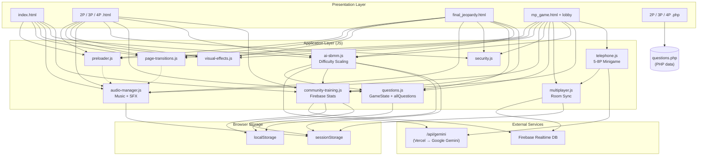

# Marvel Jeopardy!

A browser-based Jeopardy! game built around the Marvel Universe. Play with 2–4 players locally, wager on Daily Doubles, and test your knowledge across six categories: People, Powers, Artifacts, Media, Teams, and Places.

---

## How to Play

1. **Choose a game mode** — Select 2, 3, or 4 players from the main menu.
2. **Enter player names** — Or stick with the defaults (Player 1, Player 2, etc.).
3. **Pick a category and value** — Click any card on the board. Higher values = harder questions.
4. **Answer in Jeopardy! format** — Start your answer with *"Who is,"* *"What is,"* or *"Where is."* For example: *"Who is Captain America?"*
5. **Control the board** — Answer correctly and you keep picking. Answer incorrectly and play passes to the next player.
6. **Daily Double & Final Jeopardy** — Hidden on the board is one Daily Double where you can wager your own money. After all 30 cards are cleared, Final Jeopardy gives everyone one last chance to wager and win.

### Final Jeopardy — Party-Game Features

- **Per-player lock-in** — Each player locks in their answer individually (with their own button or the `Enter` key). Once locked, the input is hidden behind a green "🔒 LOCKED IN" banner so no one can peek or change it.
- **Answer censor** — On the shared local screen, each player's answer is typed into a password-style hidden field. A "Show/Hide" toggle lets that player verify their text without other players seeing it.
- **Wager rule** — Everyone may wager up to the **highest score on the board** (not just their own score). This lets trailing players make a comeback bet equal to the leader's total.
- **Auto-reveal** — A live status shows "X of Y locked in." Once every player is locked, answers and scores are revealed automatically.

---

## Scoring System

### Base Game Points

The dollar value on each card is what you win or lose for that question:

| Card Value | Correct | Wrong / Pass / No Answer |
|------------|---------|--------------------------|
| $200       | +$200   | −$200                    |
| $400       | +$400   | −$400                    |
| $600       | +$600   | −$600                    |
| $800       | +$800   | −$800                    |
| $1,000     | +$1,000 | −$1,000                  |

- **Daily Double:** You choose your own wager (minimum $5, up to either $1,000 or your current score, whichever is higher).
- **Final Jeopardy:** Same wagering rules as Daily Double. Everyone writes down an answer secretly, then scores are updated all at once.

---

### AI-SBMM Skill Scoring *(Optional)*

> **What it is:** AI Skill-Based Match Making (AI-SBMM) is an optional system that tracks how well you play and automatically adjusts question difficulty in real time. It does **not** replace the dollar scores above — it runs in the background to make the game harder or easier as you go.

When AI-SBMM is turned on, every answer you give is converted into a **skill score**. This score is separate from your money total and is only used to decide when to bump the difficulty up or down.

#### Base Skill Weights

Each card value has a hidden "skill weight" that determines how much it affects your skill score:

| Card Value | Skill Weight |
|------------|--------------|
| $200       | 1            |
| $400       | 2            |
| $600       | 3            |
| $800       | 4            |
| $1,000     | 5            |

Higher-value questions count more toward your skill rating because they are expected to be harder.

#### How Skill Points Are Awarded

| Result | Skill Points Earned |
|--------|---------------------|
| **Correct + Fast** (≤ 6 seconds) | `Base Weight × 2.0` |
| **Correct + Normal** (6–21.6 seconds) | `Base Weight × 1.0` to `Base Weight × 2.0` (linear scale) |
| **Correct + Slow** (≥ 21.6 seconds) | `0` (too slow — no skill credit) |
| **Wrong answer** | `−(Base Weight × 0.5)` |
| **No answer / Passed** | `−(Base Weight × 1.25)` |

**Speed multiplier breakdown:**
- Answering in **6 seconds or less** gives the full **2×** bonus.
- Answering in **21.6 seconds or more** gives **zero** skill points even if correct.
- Anything in between scales smoothly from 1× up to 2×. For example, answering in about 13.8 seconds earns roughly 1.5× the base weight.

#### Difficulty Adjustment

The system watches your running skill score and streaks to decide when to shift difficulty:

| Trigger | What Happens |
|---------|--------------|
| Skill score reaches **+10** | Difficulty increases by 1 level (Normal → Hard → Expert) |
| Skill score drops to **−6** | Difficulty decreases by 1 level |
| **3 wrong answers in a row** | Difficulty decreases by 1 level |

There are three difficulty levels:
- **Normal** — Standard question set.
- **Hard** — Questions are replaced with harder variants via AI (Google Gemini).
- **Expert** — Even harder AI-generated questions with reduced hint tolerance.

After every difficulty change, your skill score and streak counters are reset so the system doesn't bounce you up and down instantly.

#### Oscillation Dampener

If you keep bouncing between two difficulty levels (e.g., Normal ↔ Hard), the system detects this "yo-yo" pattern and **temporarily softens skill-point swings by 40%**. This makes it easier to settle into the right tier instead of constantly flipping.

- Oscillation is detected when the last 3 difficulty changes alternate between exactly 2 levels (e.g., Normal → Hard → Normal).
- The dampener is active for your first 5 answers after each difficulty change.
- Once you stabilize in one tier for 2+ answers, full scoring resumes.

#### Question Caching

The first time you reach Hard or Expert, the system fetches a full board of AI-generated questions from Gemini and **caches them in memory for the session**. If you later drop back down and then return to that same tier, the cached questions are restored instantly — no extra API call, no wait, and no duplicate questions.
- Cache is cleared at the start of every new game so each match starts fresh.

---

### Community Training *(Optional — requires AI-SBMM)*

> **What it is:** Community Training anonymously pools data from completed matches (category picks, correctness, and timing) and uses that community-wide data to subtly nudge the AI-SBMM skill scores. It does **not** affect your dollar total.

Community Training is entirely opt-in and only activates when AI-SBMM is already enabled. No personal information is ever stored — only aggregate statistics like "People $200 was picked 12 times and answered correctly 8 times."

#### How It Adjusts Your Skill Score

Community Training applies a small modifier (up to **±35%**) to your raw skill points for each answer. The modifier is based on two community-driven factors:

**1. Pick Popularity (`pickMod`) — applies to *correct* answers**
- **Rarely picked** categories/values → **bonus** (you found an under-explored card)
- **Commonly picked** categories/values → **slight reduction** (everyone already goes for these)

**2. Miss Rate (`missMod`) — applies to *wrong* and *no-answer* results**
- **Commonly missed** by the community → **lighter penalty** (the question is genuinely tough)
- **Rarely missed** by the community → **heavier penalty** (most players get this right)

#### Modifier Math

Both the category and the dollar value contribute independently:

1. A **category modifier** is calculated based on how the community performs in that category.
2. A **value modifier** is calculated based on how the community performs at that dollar amount.
3. The two are averaged together.
4. The final result is clamped so it can never exceed **±35%** of your raw skill points.

**Example 1 — modifier within bounds**
- You correctly answer a $600 "Artifacts" question in 6 seconds.
- Raw skill points: `3 (base weight) × 2.0 (speed) = 6.0`
- The community picks "Artifacts" very often (`pickMod` = −0.10) and rarely picks $600 (`pickMod` = +0.14).
- Average modifier: `(−0.10 + 0.14) / 2 = +0.02`
- Final skill points: `6.0 × 1.02 = 6.12`

**Example 2 — modifier clamped at the +35% ceiling**
- You correctly answer a $1,000 "Places" question in 5 seconds.
- Raw skill points: `5 (base weight) × 2.0 (speed) = 10.0`
- "Places" is rarely picked by the community (`pickMod` = +0.60) and $1,000 is also under-explored (`pickMod` = +0.50).
- Average modifier: `(0.60 + 0.50) / 2 = +0.55`
- The modifier is **clamped** to the +35% ceiling: `+0.35`
- Final skill points: `10.0 × 1.35 = 13.5`

**Example 3 — modifier clamped at the −35% floor (wrong answer)**
- You answer a $400 "People" question incorrectly.
- Raw penalty: `−(2 × 0.5) = −1.0`
- The community commonly misses "People" (`missMod` = −0.50) and $400 is a frequent trap (`missMod` = −0.40).
- Average modifier: `(−0.50 + −0.40) / 2 = −0.45`
- The modifier is **clamped** to the −35% floor: `−0.35`
- Final penalty: `−1.0 × (1.0 − 0.35) = −0.65` (lighter than the raw −1.0 penalty)

#### Requirements

- Data is only submitted after a full game is completed (all 30 cards cleared + Final Jeopardy finished).
- Weights are refreshed from the community pool every 5 minutes.

---

## System Improvements

### Grammar-Aware Answer Formatting

Correct-answer modals now use a grammar formatter that ensures displayed answers read naturally in Jeopardy! phrasing:
- **Articles** are preserved in lowercase and inferred from alternate valid answers when missing (e.g., `"black order"` is displayed as `"the Black Order"` because `"the black order"` is an accepted alternate).
- **Acronyms** are auto-uppercased (e.g., `s.h.i.e.l.d.` → `S.H.I.E.L.D.`).
- **Title casing** is applied with hyphen support (e.g., `x-men` → `X-Men`).

### Audio Optimization

Sound effects and hover audio have been optimized to eliminate "hang" and stacking issues, especially during first load:
- **Preload guarantee** — The generic hover sound element is force-preloaded on initialization so the first mouseover responds immediately.
- **Ready-state gating** — Sound effects only play once the audio buffer is ready (`readyState ≥ 2`), preventing stalled triggers.
- **Concurrent limit** — A maximum of 3 overlapping clones per sound name prevents audio stacking during rapid interaction.
- **Resource cleanup** — Audio clones are automatically cleaned up (`src = ''`, `remove()`) after playback or on error.
- **Faster music preload** — Background music tracks begin preloading after 2 seconds instead of 6.

### Audio Resilience Across Reloads

If you reload the page, switch tabs, or navigate via the back-forward cache, background music and sound effects automatically resume where they left off. State is persisted to `sessionStorage` and the audio element is rebuilt on bfcache restore.

---

## Keyboard Shortcuts

| Key | Action |
|-----|--------|
| `Ctrl + S` | Print live AI-SBMM stats snapshot to the browser console (only when AI-SBMM is enabled) |

---

## Tech Stack

- HTML / CSS / vanilla JavaScript (no frameworks)
- Firebase Realtime Database (for Community Training aggregate stats)
- Google Gemini API via Vercel proxy (for dynamic hard/expert question generation)
- Local / session storage for game state persistence

---

## `.gitignore`

The following files and directories are excluded from version control:

| Pattern | Reason |
|---------|--------|
| `.vercel` | Vercel deployment metadata |
| `.DS_Store` | macOS system files |
| `Thumbs.db` | Windows thumbnail cache |
| `desktop.ini` | Windows folder settings |
| `*.tmp` | Temporary files |
| `*.bak` | Backup files |
| `*~` | Editor swap/backup files |

---

---

## System Architecture



### Architecture Overview

The project is split into **three distinct game modes** that share the same question bank but use different state and rendering strategies:

| Mode | Pages | State | Key Features |
|------|-------|-------|--------------|
| **Local JS** | `2P/3P/4P.html`, `final_jeopardy.html` | `localStorage` (`GameState`) | Full preloader, transitions, audio, AI-SBMM, Community Training, visual effects |
| **Online MP** | `lobby.html`, `mp_game.html`, `2P/3P/4P_mp.html` | Firebase RTDB + `sessionStorage` | Everything in Local JS plus real-time sync, 2-8 players, Telephone minigame |
| **Legacy PHP** | `2P/3P/4P.php`, `final_jeopardy.php` | PHP `$_SESSION` | Basic server-rendered gameplay; no AI-SBMM, no transitions, no audio manager |

### Data Flows

**1. Question Generation (AI-SBMM)**
```
ai-sbmm.js → /api/gemini (Vercel) → Google Gemini API
     ↓
generatedQuestions[difficulty] (in-memory cache)
     ↓
questions.js (allQuestions)
```
- Hard/Expert questions are generated once per tier and cached in memory for the session.
- A 12-second cooldown and per-IP rate limiting prevent API abuse.

**2. Community Training**
```
community-training.js ↔ Firebase Realtime DB (/community_training/stats)
     ↓
ai-sbmm.js (score modifiers)
```
- Match data is submitted to Firebase after a full game completes.
- Weights are fetched every 5 minutes and applied as a ±35% modifier to raw skill points.

**3. Multiplayer State Sync**
```
multiplayer.js ↔ Firebase RTDB (/rooms/{code}/gameState)
     ↓
mp_game.html (render grid, turns, feedback)
```
- The host writes game state; all clients listen and re-render on changes.
- Player presence, scores, used cells, and audio state are all synced in real time.

**4. Audio Lifecycle**
```
page-transitions.js → AudioManager.fadeOut()
     ↓
navigation → new page → AudioManager.restoreState() → resume playback
```
- Audio state is saved to `sessionStorage` on page hide/unload and restored on entry.
- The service worker ensures audio assets are cached for offline playback.

**5. Browser Storage Map**

| Key | Storage | Owner | Purpose |
|-----|---------|-------|---------|
| `marvelJeopardyState` | `localStorage` | `GameState` | Scores, names, board state |
| `finalJeopardyState` | `localStorage` | `FinalJeopardy` | FJ wagers, answers, results |
| `mj_ai_sbmm_enabled` | `localStorage` | `AISBMM` | Toggle + difficulty level |
| `mj_ct_enabled` | `localStorage` | `CommTraining` | CT toggle |
| `mj_ai_sbmm_metrics` | `sessionStorage` | `AISBMM` | Session skill metrics |
| `mj_ct_weights` | `sessionStorage` | `CommTraining` | Cached community weights |
| `mj_ct_matchlog` | `sessionStorage` | `CommTraining` | Per-match pick log |
| `mj_audio_state` | `sessionStorage` | `AudioManager` | Track, volume, mute |
| `mp_roomCode` | `sessionStorage` | `MultiplayerManager` | Active room |
| `mp_playerNumber` | `sessionStorage` | `MultiplayerManager` | Player slot |

## Credits

- Marvel characters, locations, and lore are property of Marvel Entertainment.
- Jeopardy! format inspired by the classic TV game show.
